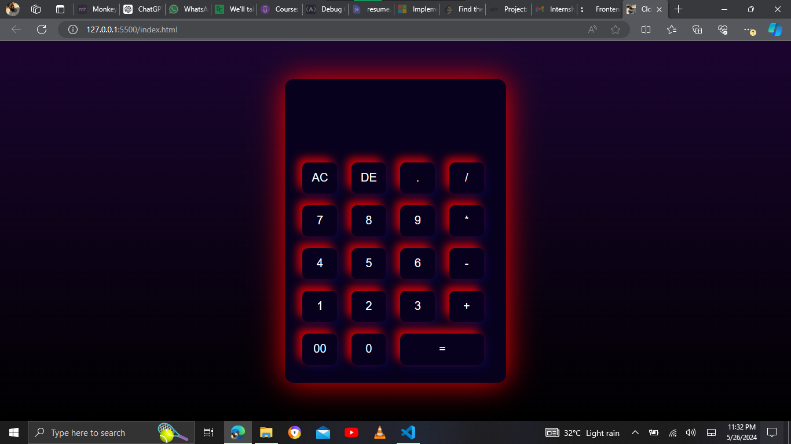

# Clcltr

A stylish calculator app built with HTML, CSS, and JavaScript. The app features gradient neon colors and interactive buttons that scale in size on mouseover.

## Features

- Basic arithmetic operations: addition, subtraction, multiplication, and division.
- Responsive neon-themed design with gradient colors.
- Interactive buttons that scale on mouseover for a dynamic user experience.

## Demo

[Click here to see the live demo](https://ademolaademeso-clcltr.vercel.app)

## Screenshots



## Installation

1. Clone the repository:

    ```bash
    git clone https://github.com/KingDez04/Clcltr.git
    ```

2. Navigate to the project directory:

    ```bash
    cd Clcltr
    ```

3. Open `index.html` in your preferred web browser.

## Usage

- Click the buttons to perform arithmetic operations.
- Hover over the buttons to see the scaling effect.

## Code Structure

- `index.html`: Contains the HTML structure of the calculator.
- `styles.css`: Contains the CSS for styling the calculator with gradient neon colors and button scaling effect.
- `script.js`: Contains the JavaScript code for the calculator functionality.